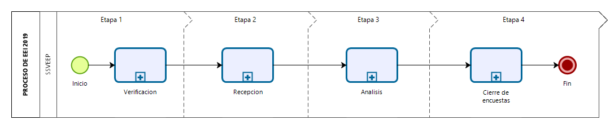

class: center, middle

.linea-superior[]
.linea-inferior[]


## Levantamiento EEI 2019

### Subdepartamento de Estadísticas de Industria (SDEI)

### Abril 2021


```{r setup, include=FALSE}
#rm(list = ls(), envir = environment())
options(htmltools.dir.version = FALSE)
knitr::opts_chunk$set(message = FALSE, echo = FALSE, fig.align="center", warning = FALSE) 
aniview::use_aniview()
#install.packages('addinslist')
#xaringan::summon_remark() 
  
```


```{r xaringan-themer, include=FALSE, warning=FALSE}
library("xaringanthemer")
#style_mono_light(base_color = "#002d73")
# style_duo_accent(
# primary_color = "#1381B0",
# secondary_color = "#FF961C",
# inverse_header_color = "#FFFFFF"
# )

# Para guardar en PDF
#install.packages(c("pagedown", "xaringan"))
#pagedown::chrome_print("presentacion_levantamiento_2019.Rmd")
#rmarkdown::render("presentacion_levantamiento_2019.Rmd", 

source("scripts/Problemas Analisis.R", encoding = "UTF-8")
source("scripts/Contacto.R", encoding = "UTF-8")
source("scripts/Clasificacion.R", encoding = "UTF-8")
source("scripts/Errores Procesamiento.R", encoding = "UTF-8")
source("scripts/Resultados 2019.R", encoding = "UTF-8")

# CONTACTO: ques es otros? --> Se utiliza en casos especiales por ejemplo cuando se tiene que abrir una planta nuevo 

# ¿De acuerdo a SDT cuales son los principales problemas detectados en F3-F4 durante el 2019?, Averiguar que significa PROBLEMA: Problemas de clasificación, validación o del balance.

```


---
background-image: url("imagenes/fondo2.PNG")
background-size: contain;
background-position: 100% 0%

# 1. Introducción

Las encuestas estructurales de industria tienen de objetivo:
- Generar un marco apropiado del sector industrial
- Clasificar el balance contable de las empresas de acuerdo a los campos de las encuestas
- Clasificar los productos e insumos de la producción de empresas manufactureras y mineras
- Clasificar a las unidades económicas de acuerdo a su producción

---
background-image: url("imagenes/fondo2.PNG")
background-size: contain;
background-position: 100% 0%

# 2.1. Objetivo general de Industria

Las EEI son un instrumento estadístico censal, de frecuencia anual, que tiene por **objetivo general** capturar información detallada sobre distintos aspectos estructurales del sector industrial nacional. 

--

Como productor, se obtienen datos contables de insumos utilizados, ventas y factores productivos que participan en el proceso de transformación. Esta información permite calcular variables sectoriales de importancia, para publicar variables tales como: 
- Valor Agregado (VA)
- Consumo Intermedio (CI)
- Ingresos, Producción física y valorada. 
- Empleo y remuneraciones
- Inversión y depreciación 

--

Esto responde a la necesidad de contar con información que permita dar cuenta sobre la capacidad industrial del país y así contar con información de mejor calidad para la elaboración de las Cuentas Nacionales y otros indicadores estadísticos-económicos del país.


---
background-image: url("imagenes/fondo2.PNG")
background-size: contain;
background-position: 100% 0%

# 2.2. Estructura de los Productos EEI

Los productos EEI abarcan 8 productos del sector industrial del país

| PRODUCTO | LETRA | Descripción | División | Unidad |
|:---------|:------|:------------|:-------|:-------|
|ENAM	| B |	Explotación de minas y canteras	| 05 - 09	| Establecimiento|
|ENIA	| C	| Industrias manufactureras	| 10 - 33	| Establecimiento|
|ENADE-ENADT-ENADD	| D	| Suministro de electricidad, gas, vapor y aire acondicionado |3510	| Empresa|
|ENADG	| D		| | 3520	| Empresa|
|ENAES	| E	| Suministro de agua; evacuación de aguas residuales, gestión de desechos y descontaminación	| 36-37	| Empresa|
|ENAER	| E	| |	38 |	Empresa|


---
background-image: url("imagenes/fondo2.PNG")
background-size: contain;
background-position: 100% 0%

# 2.3. Ciclo operativo de EEI 2019

Las encuestas EEI comienzan su flujo operativo con la creación del directorio para identificar unidades nuevas mediante la **verificación**, con lo cual los informantes podrán acceder a completar la información, para ser **recepcionada** como unidad efectiva para el **análisis**. Finalmente, las unidades que cumplan todos los criterios serán **validadas**.

--




---
class: animated, slideInRight
background-image: url("imagenes/fondo2.PNG")
background-size: contain;
background-position: 100% 0%

# 2.4. Levantamiento 2019 

## ¿Cuántas unidades se levantan desde los directorios?

- Existen dos grupos de empresas relevantes: Prioritarias Banco y No Prioritarias
- La proporción de empresas ha ido en aumento para ENAM, ENAER y ENADE

```{r}
library(plotly)
ggplotly(Graficos_Analisis[[14]], height = 400, width = 820) 

```

---
class: animated, slideInRight
background-image: url("imagenes/fondo2.PNG")
background-size: contain;
background-position: 100% 0%

# 2.4. Levantamiento 2019 

## ¿Cuántas unidades se levantan desde los directorios?

- El producto ENIA es el más grande por número de empresas que lo componen
- ENIA es el producto con mayor cantidad de formularios y de preguntas (320 códigos solo en F1, 260 códigos un F2 y 30 líneas posibles tanto para F3 como F4)

```{r}
ggplotly(Graficos_Analisis[[15]], height = 400, width = 820)

```

---
class: animated, slideInRight
background-image: url("imagenes/fondo2.PNG")
background-size: contain;
background-position: 100% 0%

# 2.4. Levantamiento 2019 

## ¿Cuántas unidades efectivamente se logra capturar?

Para 2019, del total de las unidades el 26% quedó en análisis, el 43% no se obtuvo captura con el informante y solo el 24% logró terminarse. 

```{r}
ggplotly(Graficos_Analisis[[1]], height = 400, width = 820)

```


---
class: animated, slideInRight
background-image: url("imagenes/fondo2.PNG")
background-size: contain;
background-position: 100% 0%

# 2.4. Levantamiento 2019 

## ¿Existen diferencias por tamaño de las unidades?

- Del total de unidades, el 60% corresponden a PYME
- En las PYME el 49% de las unidades no se logró captura de la información

```{r}
ggplotly(Graficos_Analisis[[2]], height = 420, width = 820)

```

---
class: animated, slideInRight
background-image: url("imagenes/fondo2.PNG")
background-size: contain;
background-position: 100% 0%

# 2.5. Contactos de las unidades

## ¿Cuál es el principal medio de contacto con las unidades?

- El informante es generalmente el contador, directivo o externos de las empresas.
- El principal medio de contacto es por correo (64%), seguido de telefónico (28%) y finalmente notas externas (8%).


```{r}
ggplotly(GRAFICOS_CONTACTO[[3]], height = 400, width = 820)

```

---
class: animated, slideInRight
background-image: url("imagenes/fondo2.PNG")
background-size: contain;
background-position: 100% 0%

# 2.5. Contactos de las unidades

## ¿Cómo se contactan a las unidades?

- La gestión por correo es mayor por los correos masivos de apertura y del primer contacto. Luego, la gestión baja considerablemente en las siguientes subetapas.


```{r}
ggplotly(GRAFICOS_CONTACTO[[2]], height = 400, width = 820)

```

---
class: animated, slideInRight
background-image: url("imagenes/fondo2.PNG")
background-size: contain;
background-position: 100% 0%

# 2.5. Contactos de las unidades

## ¿De las unidades no logradas, cómo fue el tipo de contacto?

Para 2019 se ve un aumento del 196% en contacto negativo para las unidades que no hubo respuesta

```{r}
ggplotly(GRAFICOS_CONTACTO[[5]], height = 400, width = 820) 

```


---
class: animated, slideInRight
background-image: url("imagenes/fondo2.PNG")
background-size: contain;
background-position: 100% 0%

# 2.6. Análisis 2019 

## De las unidades contactadas efectivas, ¿Cuántas entran en el procesamiento?

- Para 2019 se obtuvieron un total de 3.566 unidades efectiva (analizadas, validadas, no exigibles, enviada y digitada), de las cuales solo 3.162 unidades se procesaron (analizadas y validadas). Del total procesado, **el 51% quedó en análisis**.
- El porcentaje de encuestas que quedan en análisis por tamaño de empresa, pasa del 65% en las grandes al 38% en las PYME.

```{r}
ggplotly(Graficos_Analisis[[5]], height = 340, width = 820)

```

---
class: animated, slideInRight
background-image: url("imagenes/fondo2.PNG")
background-size: contain;
background-position: 100% 0%

# 2.6. Análisis 2019 

## Recepción, Análisis y Validación de unidades mensuales

```{r}

kbl(Graficos_Analisis[[12]][,2:7], booktabs = T, caption = "Estado de unidades por mes del 2019", escape = F, centering = T , align = c("c","c","c","c","c","c"), format = 'html') %>%
kable_styling(full_width = TRUE, font_size = 15) 

```

---
class: animated, slideInRight
background-image: url("imagenes/fondo2.PNG")
background-size: contain;
background-position: 100% 0%

# 2.6. Análisis 2019 

## Análisis de unidades mensuales

- El promedio mensual es de **437 unidades analizadas**, mientras que la cantidad de encuestas validadas mensual llega a las 254 unidades (2015-2019).
- Se ve una baja constante de la cuota de unidades analizadas mensual, siendo para 2019 la más baja registrada. Incluso, se ve un anomalía en el mes 9, que corresponde al mes de enero que se pasaron todas las unidades a en análisis sin completar datos de F3, F4 o Balances... 


---
class: animated, slideInRight
background-image: url("imagenes/fondo2.PNG")
background-size: contain;
background-position: 100% 0%

# 2.6. Análisis 2019 

### El ritmo de trabajo no es lineal ni constante durante los meses de procesamiento

```{r}
Graficos_Analisis[[13]]

```

---
class: animated, slideInRight
background-image: url("imagenes/fondo2.PNG")
background-size: contain;
background-position: 100% 0%

# 2.7. Validaciones 2019 

## Las unidades procesadas tienen por objetivo validar la información

- Para 2019 se genero aviso tardío de que las validaciones intertemporales tienen un procedimiento manual externo para omitirlas. Esto generó que se ejecutaran en empresas no prioritarias. 
- Las validaciones aumentaron principalmente en unidades no prioritarias.
- Aumentaron desde 2018 las validaciones intertemporales de **Advertencia**. La gran mayoría de validaciones son de **Error**.

```{r}
ggplotly(Graficos_Validaciones[[1]], height = 350, width = 820)

```

---
class: animated, slideInRight
background-image: url("imagenes/fondo2.PNG")
background-size: contain;
background-position: 100% 0%

# 2.7. Validaciones 2019 

## ¿Dónde están los principales problemas para validar la información contable-productiva?
- Las validaciones se ejecutan principalmente en la sección de empleo, compras y gastos, formulario técnico e ingresos.

```{r}
ggplotly(Graficos_Validaciones[[5]], height = 350, width = 820)

```

---
class: animated, slideInRight
background-image: url("imagenes/fondo2.PNG")
background-size: contain;
background-position: 100% 0%

# 2.7. Validaciones 2019 

## ¿El sector económico influye en las validaciones?

Los sectores 1 (Alimentos) y 4 (Cementos, maderas, papel e imprenta) es donde más validaciones saltan

```{r}
ggplotly(Graficos_Validaciones[[7]], height = 420, width = 820)

```

---
class: animated, slideInRight
background-image: url("imagenes/fondo2.PNG")
background-size: contain;
background-position: 100% 0%

# 2.7. Validaciones 2019 

## ¿El sector económico influye en las validaciones?

Incluso en los sectores 5 (Plástico, no metálico y químicos) y 2 (Textil, cueros y metales comunes) la proporción de no respuesta es significativa. El único sector que tiene buen trabajo de respuesta es el sector 3 (Otras manufacturas)

```{r}
ggplotly(Graficos_Validaciones[[8]], height = 420, width = 820)

```

---
class: animated, slideInRight
background-image: url("imagenes/fondo2.PNG")
background-size: contain;
background-position: 100% 0%

# 2.7. Validaciones 2019 

## ¿Cuales son las validaciones que más saltaron por Formulario?

```{r}
kbl(TOP10_VAL, booktabs = T, caption = "TOP 3 de validaciones por Formulario", escape = F, centering = T , align = c("c","c","l","c"), format = 'html') %>%
kable_styling(full_width = TRUE, font_size = 13) 
```

---
class: animated, slideInRight
background-image: url("imagenes/fondo2.PNG")
background-size: contain;
background-position: 100% 0%

# 2.8. Clasificación F3-F4 2019 

## ¿Dónde están los principales problemas para validar la información de Producción y Consumo?

```{r}
ggplotly(GRAFICO_F3F4[[1]], height = 400, width = 820)

```

---
class: animated, slideInRight
background-image: url("imagenes/fondo2.PNG")
background-size: contain;
background-position: 100% 0%

# 2.8. Clasificación F3-F4 2019 

## ¿De acuerdo a SDT cuales son los principales problemas detectados en F3-F4 durante el 2019?

```{r}
TABLA_CPC <- TABLA_CPC %>% arrange(desc(PC_TOTAL))
kbl(TABLA_CPC, booktabs = T, caption = "Errores de F3F4 ", escape = F, centering = T , align = c("l","c","c","c","c"), format = 'html') %>%
kable_styling(full_width = TRUE, font_size = 15) %>% 
  column_spec(2:5, width = "5em") 


```


---
class: animated, slideInRight
background-image: url("imagenes/fondo2.PNG")
background-size: contain;
background-position: 100% 0%

# 2.8. Clasificación F3-F4 2019 

## ¿De acuerdo a Nomenclaturas cuales es el estado de conformidad en F3-F4 durante el 2019?
Nomenclatura y SDT entregan insumos para mejorar la clasificación:
- Protocolo de Auditoría
- Capacitaciones de años anteriores
- Tablas de correspondencia
- Actualizaciones al catálogo CPC y Rectificaciones 
- Consultas de clasificación históricas

```{r}
TABLA_NOMENCLATURA[[1]] <- TABLA_NOMENCLATURA[[1]] %>% arrange(desc(PC_TOTAL))
kbl(TABLA_NOMENCLATURA[[1]], booktabs = T, caption = "Auditoria de Nomenclatura", escape = F, centering = T , align = c("l","c","c","c","c","c","c"), format = 'html') %>%
kable_styling(full_width = TRUE, font_size = 15) %>% 
  column_spec(2:7, width = "5em") 

```


---
background-image: url("imagenes/fondo2.PNG")
background-size: contain;
background-position: 100% 0%

# 3.1. Problemas del Análisis


.pull-left[
###Dificultades:
- Para EEI 2019, la fecha de inicio de recolección fue el "2020/05/12", **un mes más de lo usual** y la fecha de inicio del análisis comenzó en agosto (dos meses luego de lo normal)
- Probemas con la gestión de captura (**sin teléfonos**)
- Se intentó implementar herramienta de análisis sin éxito
- Disminución del número de analistas SDO
- Metas no definidas y falta de supervisión de datos
- Efecto reestructuración, **error de arrastre** y herencia de procesos no documentados, estandarizados ni automatizados
]

--

.pull-right[
##Logros:
- Se implementó método de clasificación balance estandarizado con segmentación de empresas por tamaño
- Se documentaron los procesos, flujos de trabajo de supervisión, analistas, manual de análisis para ENIA y EGA
- Se facilitaron **herramientas de apoyo**
- Mejora en validaciones históricas segmentadas por tamaño
- Revisión de calidad de empresas prioritarias
]


---
class: animated, slideInRight
background-image: url("imagenes/fondo2.PNG")
background-size: contain;
background-position: 100% 0%

# 3.1. Problemas del Análisis

## Unidades asignadas, efectivas, procesadas por analista

```{r}
Graficos_Analisis[[16]]
```


---
class: animated, slideInRight
background-image: url("imagenes/fondo2.PNG")
background-size: contain;
background-position: 100% 0%

# 3.2. Errores en Procesamiento 

## ¿Cuál es el principal error de la revisión de calidad?
- La **revisión de calidad** es un proceso que se realiza en cada entrega al BCCH, con el objetivo de buscar inconsistencias en la información.

```{r}
ggplotly(GRAFICOS_CALIDAD, height = 400, width = 820)

```

---
class: animated, slideInRight
background-image: url("imagenes/fondo2.PNG")
background-size: contain;
background-position: 100% 0%

# 3.2. Errores en Procesamiento 

## ¿Cuál es el principal error de la revisión económica?

- Desde ENIA 2018 que SDT realiza una revisión de indicadores económicos (VBP, CI, VA y ratios asociados)

```{r}
ggplotly(GRAFICOS_ECONOMICA, height = 400, width = 820)

```

---
class: animated, slideInRight
background-image: url("imagenes/fondo2.PNG")
background-size: contain;
background-position: 100% 0%

# 3.2. Errores en Procesamiento 

## ¿Cuál es el principal error del subproceso Editar/Imputar manual?

- Posterior a las observaciones del proceso de recolección y procesamiento, se edita e imputan los datos outliers faltantes que la contraparte operativa no es capaz de revisar

```{r}
ggplotly(GRAFICOS_IMPUTACION, height = 400, width = 820)
# Otro: Todo lo que no logró ser clasificado en alguna categoría anterior

```

---
class: animated, slideInRight
background-image: url("imagenes/fondo2.PNG")
background-size: contain;
background-position: 100% 0%

# 3.2. Errores en Procesamiento 

## ¿Cuál es el principal método del subproceso Editar/Imputar automático?

- Desde EEI 2019 se elaboran métodos de **Imputación Automática** de acuerdo a las necesidades y particularidades del producto

```{r}
ggplotly(GRAFICO_IMP_SDT, height = 400, width = 820)

```

---
class: animated, slideInRight
background-image: url("imagenes/fondo2.PNG")
background-size: contain;
background-position: 100% 0%

# 3.3. Tasa de Respuesta Final 

## La tasa de respuesta bajó en ENIA, ENAM y ENAER. En el resto de los productos se mantuvo (sobre 85%). Es preocupante la caída en la tasa de respuesta, debido principalmente a las PYME

```{r}
ggplotly(Grafico_CDF, height = 400, width = 820)

```


---
class: animated, slideInRight
background-image: url("imagenes/fondo2.PNG")
background-size: contain;
background-position: 100% 0%

# 4. Resultados

## ¿Cuál es el número de unidades finales entre lo operativo y lo técnico?

El número de unidades bajó debido a la caída en la tasa de respuesta

```{r}
GRAFICOS_PLOTLY[[1]]

```

---
class: animated, slideInRight
background-image: url("imagenes/fondo2.PNG")
background-size: contain;
background-position: 100% 0%

# 4. Resultados

## ¿Cuál es la diferencia de las variables agregadas entre lo operativo y lo técnico?


```{r}
GRAFICOS_PLOTLY[[3]]
```

---
class: animated, slideInRight
background-image: url("imagenes/fondo2.PNG")
background-size: contain;
background-position: 100% 0%

# 4. Resultados

## La base de SDO no tiene ningún control de calidad, presentando errores no menores en la base de datos analizada

```{r}
GRAFICOS_PLOTLY[[4]]


```

---
class: animated, slideInRight
background-image: url("imagenes/fondo2.PNG")
background-size: contain;
background-position: 100% 0%

# 4. Resultados

```{r}
GRAFICOS_PLOTLY[[5]]


```

---
class: animated, slideInRight
background-image: url("imagenes/fondo2.PNG")
background-size: contain;
background-position: 100% 0%

# 4. Resultados

```{r}
GRAFICOS_PLOTLY[[6]]
```

---
class: animated, slideInRight
background-image: url("imagenes/fondo2.PNG")
background-size: contain;
background-position: 100% 0%

# 4. Resultados

```{r}
GRAFICOS_PLOTLY[[7]]


```

---
class: animated, slideInRight
background-image: url("imagenes/fondo2.PNG")
background-size: contain;
background-position: 100% 0%

# 4. Resultados

```{r}
GRAFICOS_PLOTLY[[9]]


```

---
class: animated, slideInRight
background-image: url("imagenes/fondo2.PNG")
background-size: contain;
background-position: 100% 0%

# 4. Resultados

```{r}
GRAFICOS_PLOTLY[[10]]


```


---
class: animated, slideInRight
background-image: url("imagenes/fondo2.PNG")
background-size: contain;
background-position: 100% 0%

# 4. Resultados

```{r}
GRAFICOS_PLOTLY[[13]]
```


---
class: animated, slideInRight
background-image: url("imagenes/fondo2.PNG")
background-size: contain;
background-position: 100% 0%

# 4. Resultados

```{r}
GRAFICOS_PLOTLY[[11]]
```

---
class: animated, slideInRight
background-image: url("imagenes/fondo2.PNG")
background-size: contain;
background-position: 100% 0%

# 4. Resultados

```{r}
GRAFICOS_PLOTLY[[15]]
```

---
class: animated, slideInRight
background-image: url("imagenes/fondo2.PNG")
background-size: contain;
background-position: 100% 0%

# 4. Resultados

```{r}
GRAFICOS_PLOTLY[[16]]
```

---
class: animated, slideInRight
background-image: url("imagenes/fondo2.PNG")
background-size: contain;
background-position: 100% 0%

# 4. Resultados

```{r}
GRAFICOS_PLOTLY[[17]]
```


---
background-image: url("imagenes/fondo2.PNG")
background-size: contain;
background-position: 100% 0%

# 5. Logros y Desafíos

.pull-left[
**Logros:**

- Documentación de procesos
- Documentación de manuales
- Codificación de balances estandarizado
- Revisión de calidad estandarizada
- Mejora de validaciones 
- Herramientas de apoyo
- Segmentación de empresas
- Imputación automática
- Cuadros de resultados automatizados
- Trabajo en equipo (SDT, SDO, SDTI, SID, Nomenclaturas)
]

--

.pull-right[
**Desafíos:**

- Metas no definidas
- Supervisión del proceso y los datos
- Falta de personal capacitado
- Separar procesos y generar equipos de trabajo de analistas por sector
- Automatizar procesos
- Fortalecer vínculo y contacto con los informantes (reuniones online)
- Mejorar herramienta de análisis de SDO
- Rediseño de nuevo formulario diferenciado por tamaño y rediseño del marco
- Automatizar validación de PYME, converso de unidad de medida, clasificación automática
]


---
class: center, middle, animated, slideInRight


.linea-superior[]
.linea-inferior[]


## Presentación de Productos EEI 2020

## SDEI

### ¡Muchas gracias!

### Abril 2021


